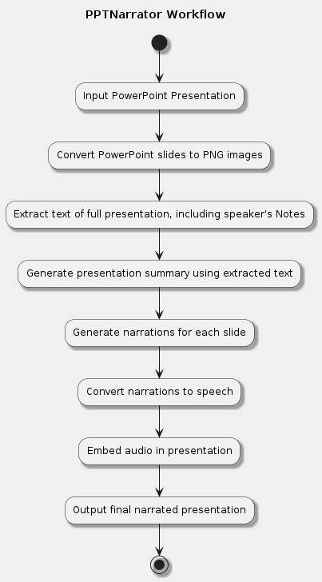

# PPTNarrator

PPTNarrator is an AI-powered tool that automatically generates audio narrations for PowerPoint presentations. It leverages Claude AI for context-aware text generation and ElevenLabs for high-quality text-to-speech conversion.

## Workflow

1. Input PowerPoint Presentation
2. Convert PowerPoint slides to high-resolution PNG images
3. Extract text and generate a summary of the presentation
4. Generate context-aware narrations for each slide using Claude AI
5. Convert narrations to speech using ElevenLabs
6. Embed generated audio narrations back into the PowerPoint
7. Output final narrated presentation


## Workflow Diagram




## Features

- Converts PowerPoint slides to high-resolution PNG images using LibreOffice
- Extracts text and speaker notes from presentations
- Generates a summary of the entire presentation for context
- Creates context-aware narrations for each slide using Claude AI
- Converts narrations to speech using ElevenLabs text-to-speech API
- Embeds generated audio narrations back into the PowerPoint presentation
- Supports multithreading for efficient audio generation

## Requirements

- Python 3.7+
- LibreOffice (for PowerPoint to PDF conversion)
- Anthropic API key (for Claude AI)
- ElevenLabs API key

## Installation

1. Clone this repository:
   ```
   git clone https://github.com/aousabdo/PPTNarrator.git
   cd PPTNarrator
   ```

2. Install the required dependencies:
   ```
   pip install -r requirements.txt
   ```

3. Set up environment variables:
   - Copy `.env.example` to `.env`
   - Fill in your API keys and other configuration in the `.env` file

## Usage

Run the script with:
```
python main.py path/to/your/presentation.pptx output_directory [options]
```

Options:
- `--generate-narrations`: Generate narrations from slides
- `--generate-audio`: Generate audio from narration files
- `--insert-audio`: Insert audio into PowerPoint

Example:
```
python main.py presentation.pptx output --generate-narrations --generate-audio --insert-audio
```

This will:
1. Convert the PowerPoint to high-resolution PNG images
2. Generate narrations for each slide
3. Convert narrations to speech
4. Create a new PowerPoint file with embedded audio

The final presentation will be saved in the same directory as the original, with "_with_audio" appended to the filename.

## Configuration

You can adjust the following settings in the `.env` file:

- `ELEVENLABS_API_KEY`: Your ElevenLabs API key
- `ANTHROPIC_API_KEY`: Your Anthropic API key
- `VOICE_ID`: The ID of the ElevenLabs voice to use
- `CHUNK_SIZE`: Chunk size for audio processing (default: 1024)
- `MAX_WORKERS`: Maximum number of concurrent workers for audio generation (default: 5)

## Contributing

Contributions are welcome! Please feel free to submit a Pull Request.

## License

This project is licensed under the MIT License - see the [LICENSE](LICENSE) file for details.
